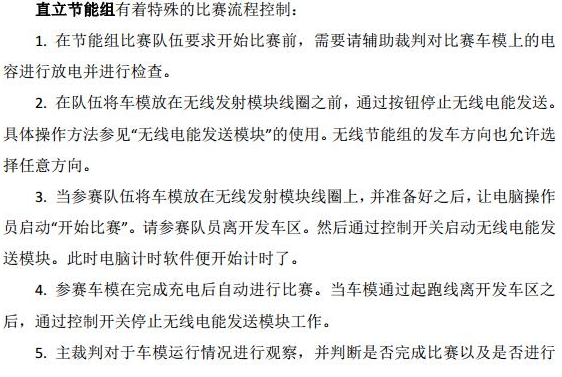
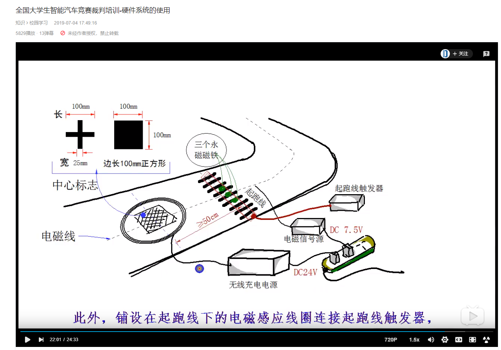

# 裁判手册中的说明

比赛流程控制：

充电线圈的标志可能如下，十字代表中心：

# 试车阶段需要做的事情

1. 找一个好的出库方向试跑一圈

2. **接上无线串口并在电脑上打开示波器点击run和绿色的运行，打开isp烧录软件**
3. 大概1min时间摸一摸最优的充电位置，注意放电到0再充电
4. 目测圆环大小，烧录圆环测试代码并推行测试，

# 发车检查

**拔掉无线串口！！！！！！**

1. 擦轮并检查两轮轴固定，如下图：

   - 轮胎前后转动齿轮跟随良好
   - 轮胎左右位置固定，即轮胎不会往外拉出来

   

2. 检查摄像头

   - 是否打开，是否90度（如果当前角度入库过晚，考虑把固定的胶撕下来（不要脱落），ccd变为90度）

3. 检查电机驱动是否打开（摁下），电源总开关是否打开（向下），五伏开关是否打开（向右）

4. T头是否全部插紧

5. 外部飞出的导线是否会磨到齿轮

6. 拨码开关拨到适当的位置，第一圈跑应当除了第一个拨码开关控制左右出库（视情况而定）外，全部打向左侧

7. 检查其他接线是否牢固，此项基本问题不大，注意编码器即可

8. 将车辆摆放到正确的位置

# 应急处理

**若车辆冲出赛道，不计成绩的情况，立刻重新发车**

1. 第一圈跑完可能出现的情况及应对方式：

   - 出库偏晚或偏早

     换代码，视频沟通，直接**烧代码**即可

   - 进圆环跑飞，跑出赛道外

     立刻停车并**关闭圆环拨码**4，尝试完成比赛，与此同时btk根据现象修改圆环代码，烧录并发车

   - 入库偏早或偏晚

     偏早不太可能吧...

     偏晚的话调节摄像头到平行位置应该就可，如果上坡摄像头磕到改变角度可以考虑用螺丝刀和十字架**把摄像头上下旋转的控制螺丝螺母拧紧**

   - 电量不够跑完一圈赛道

     视距离终点的距离而定能量拨码 ：距离不远->6拨码向右打，距离较远->5,6全部向右打，实在不行则烧代码。

   - 顺利跑完，8说了，i了i了

     用万用表检查一下跑完时还剩多少电压

     - 如果还剩电压比较多，如4v，将能量拨码5向右打，冲一圈。
     - 如果剩余电量不是很多，提速，将速度拨码2向右打，冲一圈

2. 其他情况应急处理

   - 电磁杆撞断：尝试用黑胶布补上，实在不行就用旧杆
   - 竖电感撞掉：尝试用黑胶布补上，不行就缠在杆子上，关闭圆环
   - 无法判库：尝试用距离进库

# 约定

如果改动要烧的代码涉及到拨码档：

- 比如需要的速度比拨码的最高档还要高，则改动的代码直接提高最高档位速度
- 如需要的速度比拨码最低档还要低，则改动的代码直接降低最低档位速度

